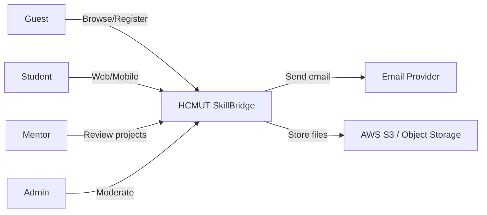
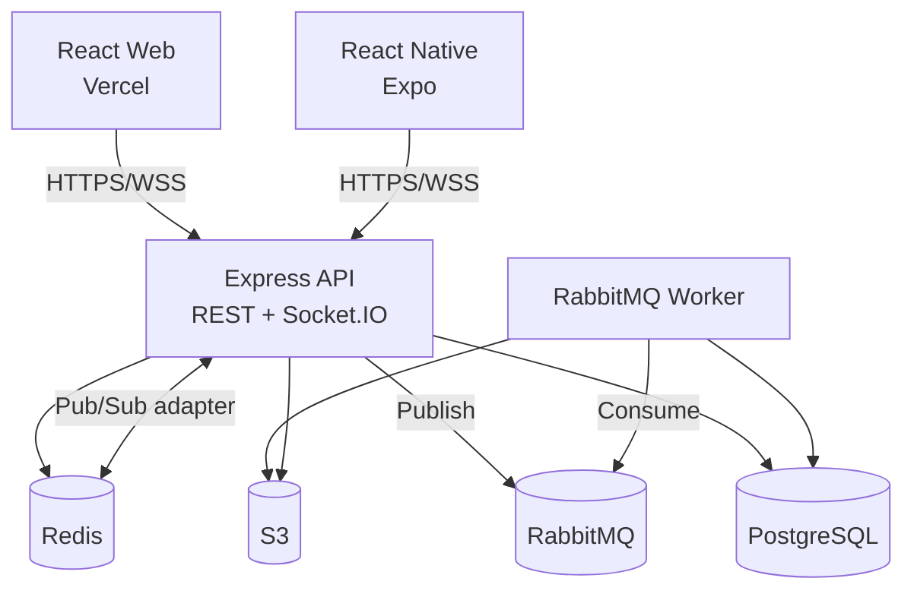
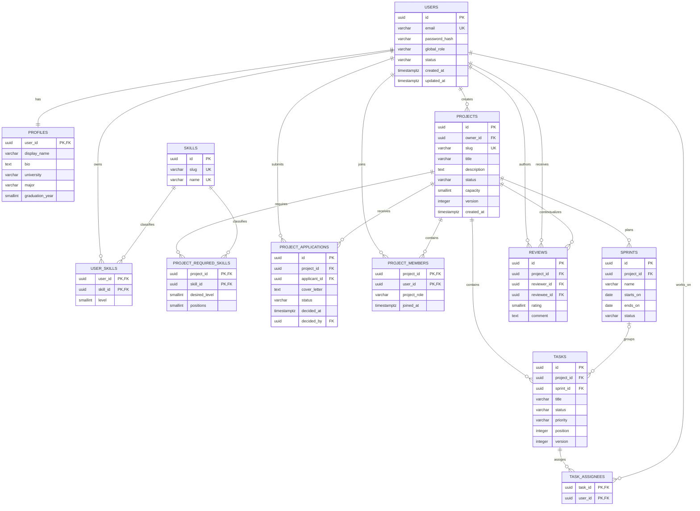
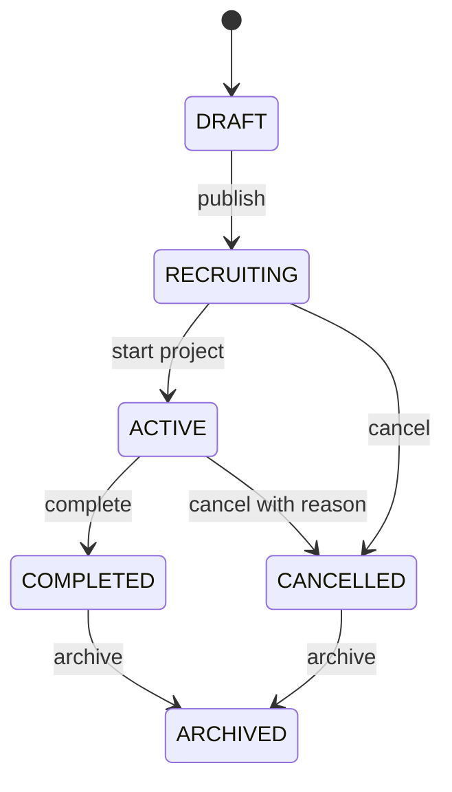
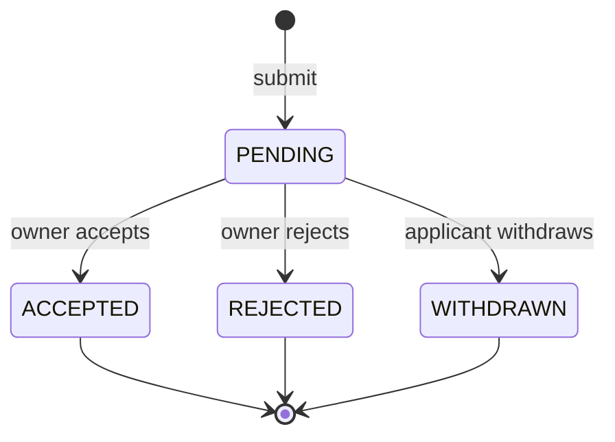
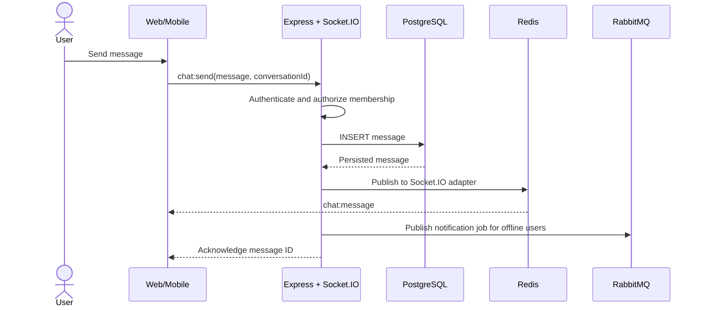
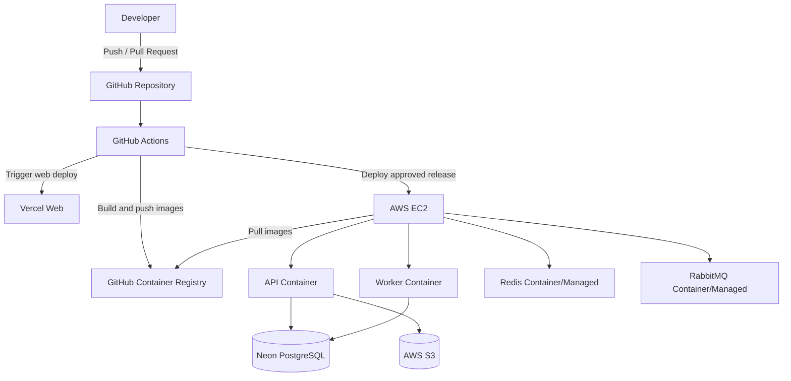
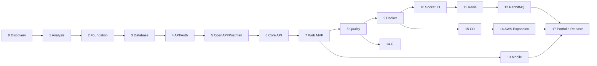

# HCMUT SkillBridge — Ultimate Full-stack Project Plan

> Trạng thái: **IN PROGRESS — requirements, database, API contracts, core domain, React web MVP, quality engineering, Docker runtime và Socket.IO realtime đã hoàn tất**
> Đối tượng học: sinh viên năm 2 HCMUT
> Mục tiêu: xây dựng một sản phẩm đủ chiều sâu để học Công nghệ phần mềm, full-stack TypeScript, cơ sở dữ liệu, realtime, message queue, DevOps, mobile và nền tảng AWS.
> Repository: [`tranbaoanh21/typescript-skill-bridge`](https://github.com/tranbaoanh21/typescript-skill-bridge)

## 1. Product vision

**HCMUT SkillBridge** là nền tảng giúp sinh viên:

- Xây dựng hồ sơ kỹ năng và portfolio.
- Đăng dự án và tuyển thành viên.
- Tìm, lọc và ứng tuyển vào dự án phù hợp.
- Quản lý team, sprint, board và task sau khi lập nhóm.
- Chat, cập nhật task và nhận thông báo theo thời gian thực.
- Nhận review từ leader hoặc mentor sau khi hoàn thành dự án.

Sản phẩm tạo ra một vòng đời hoàn chỉnh:

```text
Tạo hồ sơ → Tìm dự án → Ứng tuyển → Lập team → Làm việc → Review → Portfolio
```

### 1.1. Vấn đề cần giải quyết

Sinh viên thường gặp các vấn đề:

- Khó tìm đồng đội có kỹ năng phù hợp.
- Thông tin tuyển thành viên nằm rải rác trong group chat hoặc mạng xã hội.
- Không có quy trình thống nhất cho ứng tuyển và xét duyệt.
- Sau khi lập nhóm phải chuyển sang nhiều công cụ khác nhau để quản lý công việc.
- Kết quả dự án chưa được ghi nhận có cấu trúc để dùng cho portfolio.

### 1.2. Giá trị học tập

Đề tài được chọn vì tạo ra đủ bài toán thật cho:

- Phân tích yêu cầu và mô hình hóa hệ thống.
- Thiết kế cơ sở dữ liệu quan hệ có ràng buộc.
- Authentication, authorization và RBAC.
- REST API, OpenAPI và API testing.
- Transaction và concurrency control.
- Cache, realtime communication và asynchronous processing.
- Web, mobile, container, CI/CD và cloud deployment.

## 2. Decision gates cần chốt

Mỗi decision gate phải được chốt trước phase trực tiếp phụ thuộc vào quyết định đó; gate của các phase sau không chặn MVP foundation.

| ID | Quyết định | Đề xuất mặc định | Trạng thái |
|---|---|---|---|
| D0 | Chọn bài toán | HCMUT SkillBridge | Đã chốt 20/08/2026 |
| D1 | UI agent skill | [`leonxlnx/taste-skill`](https://github.com/Leonxlnx/taste-skill), áp dụng design audit workflow | Đã áp dụng cho web MVP 24/08/2026 |
| D2 | Phạm vi MVP | Profile + Project + Application + Team + Task | Đã chốt 20/08/2026 |
| D3 | Database access | Drizzle ORM + SQL migrations + `pg` driver | Đã áp dụng 20/08/2026 |
| D4 | Monorepo tooling | npm workspaces + Turborepo | Đã áp dụng 20/08/2026 |
| D5 | Managed PostgreSQL | Neon cho production; Postgres.app cho local | Đã chốt baseline 20/08/2026 |
| D6 | Backend deployment đầu tiên | Docker trên AWS EC2; web trên Vercel | Chờ xác nhận |
| D7 | Repository visibility | GitHub public để dùng làm portfolio | Chờ xác nhận |
| D8 | Frontend data/routing libraries | TanStack Query + React Router | Đã áp dụng 24/08/2026 |

### Vì sao đề xuất Drizzle thay vì che toàn bộ SQL

Drizzle có type safety nhưng vẫn giữ schema và SQL gần với PostgreSQL. Với mục tiêu học ràng buộc CSDL, migration, index và query plan, cách này phù hợp hơn việc chỉ thao tác qua một ORM abstraction. Các migration quan trọng vẫn phải được review bằng SQL và kiểm tra trong pgAdmin 4.

## 3. Scope

### 3.1. MVP bắt buộc

1. Đăng ký, đăng nhập, refresh token và đăng xuất.
2. Hồ sơ sinh viên, kỹ năng và portfolio links.
3. Tạo, sửa, công bố và đóng một project.
4. Khai báo kỹ năng cần tuyển và số lượng thành viên.
5. Tìm kiếm/lọc project.
6. Nộp, rút, duyệt và từ chối application.
7. Tạo membership khi application được duyệt.
8. Tạo board, sprint và task cho team.
9. Gán task, đổi trạng thái và ghi nhận lịch sử thay đổi.
10. Notification cơ bản.
11. Admin khóa/mở tài khoản và xem audit log.

### 3.2. Advanced scope

- Chat realtime theo project/team.
- Online presence và typing indicator.
- Realtime task board.
- Redis cache, rate limit và Socket.IO adapter.
- RabbitMQ cho email/notification/audit jobs.
- Mentor review và project completion certificate.
- Mobile app cho luồng student/member.
- Upload avatar/tệp lên S3-compatible storage.
- Dashboard metrics và observability.

### 3.3. Out of scope cho phiên bản học tập đầu tiên

- Thanh toán.
- Video call.
- AI matching tự động.
- Microservices hoàn chỉnh.
- Kubernetes.
- Multi-region hoặc active-active database.

Các mục này chỉ được thêm sau khi toàn bộ acceptance criteria của MVP đạt yêu cầu.

## 4. Actors và permission model

| Actor | Năng lực chính |
|---|---|
| Guest | Xem project public, đăng ký, đăng nhập |
| Student | Quản lý profile, ứng tuyển, tham gia project |
| Project Owner | Quản lý project, application và team của mình |
| Team Member | Dùng board, task và chat trong project đã tham gia |
| Mentor | Theo dõi project được phân công, review kết quả |
| Admin | Quản trị user, nội dung và audit log |

Phân quyền gồm hai lớp:

- **Global role:** `STUDENT`, `MENTOR`, `ADMIN`.
- **Project role:** `OWNER`, `LEADER`, `MEMBER`, được xác định bởi membership.

Backend luôn là nguồn quyết định quyền cuối cùng; frontend chỉ dùng permission để điều chỉnh trải nghiệm hiển thị.

## 5. Use cases chính

| ID | Use case | Actor | Kết quả |
|---|---|---|---|
| UC-01 | Đăng ký tài khoản | Guest | Tài khoản được tạo và email verification được gửi |
| UC-02 | Đăng nhập | User | Nhận access token và refresh token |
| UC-03 | Cập nhật hồ sơ kỹ năng | Student | Hồ sơ có thể được tìm kiếm |
| UC-04 | Công bố project | Project Owner | Project chuyển từ `DRAFT` sang `RECRUITING` |
| UC-05 | Ứng tuyển project | Student | Application ở trạng thái `PENDING` |
| UC-06 | Duyệt application | Project Owner | Application `ACCEPTED` và membership được tạo atomically |
| UC-07 | Quản lý task | Team Member | Task được tạo/cập nhật theo quyền |
| UC-08 | Chat trong team | Team Member | Message được lưu và broadcast realtime |
| UC-09 | Hoàn tất project | Project Owner | Project chuyển `COMPLETED`, cho phép review |
| UC-10 | Review thành viên | Leader/Mentor | Review trở thành một phần portfolio |
| UC-11 | Kiểm duyệt tài khoản | Admin | User bị suspend/restore và có audit record |

### 5.1. Use case scenario mẫu: duyệt application

**Tiền điều kiện**

- Owner đã đăng nhập.
- Project thuộc owner và đang ở trạng thái `RECRUITING`.
- Application đang `PENDING`.
- Candidate chưa là member của project.

**Luồng chính**

1. Owner mở danh sách application.
2. Owner chọn một application và bấm Accept.
3. API xác thực owner có quyền quản lý project.
4. API bắt đầu database transaction.
5. API khóa/kiểm tra application và capacity hiện tại.
6. API cập nhật application thành `ACCEPTED`.
7. API tạo `project_membership` cho candidate.
8. API tạo outbox event `application.accepted`.
9. Transaction commit.
10. Worker xử lý event, gửi notification/email.
11. Client nhận notification realtime nếu candidate đang online.

**Luồng thay thế**

- Project đã đủ người: trả `409 PROJECT_CAPACITY_REACHED`.
- Application đã được xử lý: trả `409 APPLICATION_ALREADY_PROCESSED`.
- Người gọi không phải owner/leader: trả `403 FORBIDDEN`.

**Hậu điều kiện**

- Application và membership không thể rơi vào trạng thái không đồng nhất.
- Việc gửi notification lỗi không rollback transaction nghiệp vụ.

## 6. Functional requirements

Quy ước priority: `P0` bắt buộc, `P1` nên có, `P2` nâng cao.

| ID | Priority | Yêu cầu |
|---|---:|---|
| FR-AUTH-01 | P0 | User đăng ký bằng email/password |
| FR-AUTH-02 | P0 | Password được hash bằng thuật toán phù hợp |
| FR-AUTH-03 | P0 | Access token ngắn hạn, refresh token có rotation |
| FR-AUTH-04 | P0 | Logout thu hồi refresh session |
| FR-USER-01 | P0 | Student quản lý profile và skills |
| FR-PROJ-01 | P0 | Owner quản lý project lifecycle |
| FR-PROJ-02 | P0 | User tìm kiếm/lọc project public |
| FR-APP-01 | P0 | Student ứng tuyển hoặc rút application |
| FR-APP-02 | P0 | Owner accept/reject application |
| FR-TEAM-01 | P0 | Chỉ member truy cập workspace riêng của project |
| FR-TASK-01 | P0 | Member quản lý sprint, board và task theo quyền |
| FR-TASK-02 | P1 | Ghi task activity history |
| FR-CHAT-01 | P1 | Member chat realtime trong project |
| FR-NOTI-01 | P1 | User nhận và đánh dấu notification đã đọc |
| FR-REVIEW-01 | P1 | Leader/mentor review sau khi project hoàn thành |
| FR-ADMIN-01 | P0 | Admin suspend/restore user |
| FR-AUDIT-01 | P1 | Hành động nhạy cảm tạo immutable audit record |

## 7. Non-functional requirements

| Nhóm | Mục tiêu kiểm chứng được |
|---|---|
| Type safety | TypeScript strict mode cho web, API, mobile và shared packages |
| API consistency | Response/error envelope thống nhất, OpenAPI không lỗi |
| Security | Không lưu plain password/token; validate input; RBAC ở API |
| Performance | P95 read API mục tiêu dưới 500 ms trong bài load test local đã định nghĩa |
| Reliability | Transaction bảo vệ invariant khi duyệt application |
| Observability | Structured logs, request ID, health/readiness endpoints |
| Maintainability | Module boundaries, lint, typecheck, unit/integration tests |
| Portability | Local stack chạy được bằng Docker Compose |
| Accessibility | Các flow web chính sử dụng được bằng bàn phím và có label |
| Documentation | Mỗi endpoint public có OpenAPI và example |

## 8. Kiến trúc tổng thể

### 8.1. Nguyên tắc

- Bắt đầu bằng **modular monolith**.
- REST API là contract chính giữa web/mobile và backend.
- Socket.IO chỉ dùng cho realtime events; mutation quan trọng vẫn đi qua REST.
- PostgreSQL là source of truth.
- Redis không giữ dữ liệu nghiệp vụ duy nhất.
- RabbitMQ xử lý công việc bất đồng bộ, không thay transaction database.
- Dùng transactional outbox cho event quan trọng.

### 8.2. System context



### 8.3. Container view



### 8.4. Module boundaries

```text
apps/api/src/modules/
├── auth
├── users
├── skills
├── projects
├── applications
├── teams
├── tasks
├── chat
├── notifications
├── reviews
└── admin
```

Mỗi module dự kiến có:

```text
<module>/
├── domain/
├── application/
├── infrastructure/
├── http/
└── index.ts
```

Không ép dụng Clean Architecture máy móc. Chỉ tạo abstraction khi nó làm dependency direction hoặc testing rõ ràng hơn.

## 9. Monorepo dự kiến

```text
ultimate-project/
├── apps/
│   ├── web/
│   ├── api/
│   ├── worker/
│   └── mobile/
├── packages/
│   ├── contracts/
│   ├── database/
│   ├── eslint-config/
│   ├── typescript-config/
│   └── shared/
├── docs/
│   ├── requirements/
│   ├── architecture/
│   ├── database/
│   ├── api/
│   ├── testing/
│   └── deployment/
├── infrastructure/
│   ├── docker/
│   └── scripts/
├── .github/
│   ├── workflows/
│   └── pull_request_template.md
├── compose.yaml
├── package.json
├── turbo.json
└── README.md
```

## 10. Technology baseline dự kiến

### Web

- React + Vite + TypeScript.
- Tailwind CSS.
- TanStack Query cho server state.
- React Router theo mặc định; TanStack Router chỉ dùng nếu `D8` thay đổi.
- React Hook Form + Zod.
- Vitest + Testing Library.
- Playwright cho critical E2E flows.

### Taste Skill trong UI workflow

`taste-skill` là agent instruction, không được thêm như runtime dependency của ứng dụng. Baseline đề xuất cài/pin skill `design-taste-frontend` từ repository đã xác nhận và ghi lại commit/tag nguồn để kết quả không đổi ngoài ý muốn.

Phạm vi áp dụng:

- Landing page, authentication shell, public project discovery và portfolio/profile presentation.
- Thiết lập design read, typography, spacing, color, motion, responsive rules và pre-flight design audit.
- Dùng như critique/checklist; mọi output vẫn phải qua review, accessibility test và performance check.

Phạm vi không áp dụng máy móc:

- Dashboard, data table, multi-step form, Kanban và realtime chat vì default skill tự công bố đây không phải target chính.
- React Native; mobile có design brief/token chung nhưng implementation theo native interaction patterns.
- Business logic, information architecture, authorization hoặc API/data-state architecture.

Quy trình UI mỗi feature:

1. Viết brief gồm audience, job-to-be-done, content hierarchy và constraints.
2. Chọn page kind và phạm vi sử dụng Taste Skill.
3. Chốt design tokens/wireframe trước khi code.
4. Implement đầy đủ loading, empty, error và permission states.
5. Chạy responsive, keyboard, contrast, reduced-motion và visual-regression checks.
6. Audit lại bằng Taste Skill ở nơi phù hợp, nhưng không hy sinh usability để chạy theo hiệu ứng.

### API

- Node.js `24.x` (Krypton LTS tại thời điểm 20/08/2026), pin major/minor phù hợp trong `.nvmrc`/`.node-version`; nâng version phải qua CI.
- Express + TypeScript strict.
- Zod cho request/environment validation.
- `@asteasolutions/zod-to-openapi` hoặc giải pháp tương đương để tránh schema drift.
- Pino cho structured logging.
- Vitest/Supertest cho unit và integration tests.

### Database

- PostgreSQL local từ Postgres.app, quản trị bằng pgAdmin 4.
- Drizzle ORM + PostgreSQL driver `pg` theo đề xuất D3.
- Migration files được version control.
- Test database độc lập trong Docker.
- Production database trên Neon theo đề xuất D5.
- API container dùng TCP connection pool có giới hạn; production có thể dùng Neon pooled connection string. Migration/administration giữ direct connection riêng khi tính năng không tương thích PgBouncer transaction mode.

### Realtime và asynchronous work

- Socket.IO cho WebSocket/fallback transport.
- Redis cho cache, rate limit, presence và Socket.IO adapter.
- RabbitMQ cho durable background jobs.
- Outbox pattern cho event gắn với transaction nghiệp vụ.
- Redis nằm trong private network, có ACL/TLS khi đi qua mạng không tin cậy; Socket.IO Pub/Sub payload không được xem là kênh đã tự mã hóa/xác thực.

### DevOps

- Docker multi-stage builds.
- Docker Compose cho local infrastructure.
- GitHub Actions cho CI.
- GHCR cho backend/worker images.
- Vercel cho web.
- AWS EC2 + Docker Compose cho deployment đầu tiên.
- Nâng cấp tùy chọn lên ECS/Fargate sau khi hệ thống ổn định.

Vercel Functions hiện có WebSocket native, nhưng connection bị pin vào một function trong thời lượng tối đa của function và connection sau không được bảo đảm vào cùng instance. Ta vẫn chọn backend container trên AWS ở baseline để thực hành image-based CD, process dài hạn, sticky session/load balancing và topology nhiều Socket.IO instances. Đây là lựa chọn kiến trúc học tập, không phải vì Vercel hoàn toàn không có WebSocket.

## 11. ERD draft

ERD dưới đây chỉ mô tả core domain. Chat, notification, refresh session và audit sẽ được tách thành ERD phụ để diagram không quá rối.



### 11.1. Database invariants cần được kiểm chứng

- Email được normalize và unique không phân biệt hoa thường.
- `user_skills.level` nằm trong miền giá trị đã định nghĩa.
- `projects.capacity > 0`.
- Một user chỉ có một active application cho mỗi project.
- Owner luôn là một member của project.
- Một user chỉ có một membership trong mỗi project.
- Task assignee phải là member của cùng project.
- Sprint start date không sau end date.
- Rating nằm từ 1 đến 5.
- Reviewer và reviewee không được là cùng một user.
- Review chỉ được tạo khi project đã hoàn thành.
- Không vượt capacity khi accept application đồng thời.

Không phải invariant nào cũng phù hợp với `CHECK`. Phase database sẽ phân loại rõ:

- Constraint khai báo trong PostgreSQL.
- Unique/partial index.
- Foreign key.
- Trigger.
- Transaction + row lock trong application service.

## 12. State diagrams

### Project lifecycle



### Application lifecycle



## 13. Sequence diagram: realtime chat



## 14. Deployment draft



## 15. Git strategy

### 15.1. Branch model

- `main`: protected, luôn ở trạng thái build/test được.
- `feat/<scope>`: feature.
- `fix/<scope>`: bug fix.
- `docs/<scope>`: documentation.
- `chore/<scope>`: tooling/infrastructure.

Không duy trì `develop` lâu dài. Branch ngắn giúp giảm merge conflict và dễ hiểu hơn với một developer.

### 15.2. Commit convention

```text
feat(auth): add refresh token rotation
fix(applications): prevent accepting beyond capacity
docs(architecture): add deployment diagram
test(projects): cover publish transition
chore(ci): add pull request quality checks
```

### 15.3. Pull request rules

- Không push feature trực tiếp vào `main`.
- PR có mô tả, test evidence và checklist.
- CI phải pass: format, lint, typecheck, unit, integration, build.
- Migration phải có phần rollback/forward-fix note.
- Squash merge.
- Xóa branch sau khi merge.

### 15.4. Bài thực hành Git/GitHub đầu tiên

1. Tạo initial commit trên `main` chỉ chứa repository baseline.
2. Tạo branch `docs/project-roadmap`.
3. Commit tài liệu đã được chốt.
4. Push branch và mở PR.
5. Quan sát CI chạy theo `pull_request` trigger.
6. Review diff và squash merge.
7. Pull `main` mới về local.
8. Xóa branch local và remote.
9. Kiểm chứng `git status`, branch list và log sạch.

## 16. Roadmap theo phase

Thời lượng chỉ là ước lượng học tập. Mỗi phase kết thúc bằng demo và retrospective ngắn; không chuyển phase nếu acceptance gate chưa đạt.

### Phase 0 — Product discovery và scope (2–3 ngày)

**Mục tiêu**

- Chốt vấn đề, actor, phạm vi MVP và decision gates D0–D8.
- Biến ý tưởng thành yêu cầu có thể kiểm thử.

**Công việc**

- Viết problem statement và product vision.
- Xác định personas.
- Chốt functional/non-functional requirements.
- Viết glossary để thống nhất thuật ngữ.
- Tạo product backlog và ưu tiên P0/P1/P2.
- Ghi assumptions, risks và open questions.

**Deliverables**

- `docs/requirements/product-vision.md`
- `docs/requirements/srs.md`
- `docs/requirements/glossary.md`
- `docs/requirements/backlog.md`
- Architecture Decision Records cho D0–D8.

**Acceptance gate**

- Mỗi P0 feature có actor, precondition và expected outcome.
- MVP có thể hoàn thành mà không cần advanced scope.
- Không còn decision gate blocking.

### Phase 1 — Software engineering analysis và diagrams (4–6 ngày)

**Mục tiêu**

- Hoàn thành bộ tài liệu CNPM trước khi code nghiệp vụ.

**Công việc**

- Use case overview và use case scenarios.
- System context, container và component diagrams.
- ERD conceptual và logical.
- Sequence diagrams cho auth, accept application, task update và chat.
- Activity/state diagrams.
- Deployment và CI/CD diagrams.
- Traceability matrix: requirement → use case → endpoint → test.

**Deliverables**

- Mermaid source trong `docs/architecture/`.
- `docs/requirements/use-cases.md`.
- `docs/requirements/traceability-matrix.md`.

**Acceptance gate**

- Mermaid render không lỗi.
- Mỗi core flow có happy path và error paths.
- Diagram và requirements không mâu thuẫn về tên/trạng thái.

### Phase 2 — Repository và monorepo foundation (3–4 ngày)

**Trạng thái:** Hoàn tất ngày 20/08/2026.

**Mục tiêu**

- Tạo nền tảng TypeScript có thể phát triển dài hạn.

**Công việc**

- Git init, `.gitignore`, `.editorconfig`, license và README.
- npm workspaces + Turborepo.
- Scaffold `web`, `api`, `worker`, packages chung.
- TypeScript strict configs.
- ESLint, Prettier và import boundaries.
- Environment validation và `.env.example`.
- Conventional Commits và PR template.

**Acceptance gate**

- Fresh clone cài dependency bằng một command.
- `lint`, `typecheck`, `test`, `build` chạy từ root.
- Không có secret trong repository.

### Phase 3 — PostgreSQL design và migrations (5–7 ngày)

**Trạng thái:** Hoàn tất ngày 20/08/2026; migration, seed, integration tests và query-plan check đã chạy trên PostgreSQL 18.4.

**Mục tiêu**

- Xây dựng schema có constraint thay vì chỉ validate ở frontend/backend.

**Công việc**

- Tạo local database bằng Postgres.app và kết nối pgAdmin 4.
- Tạo schema/migrations cho auth, profile, project và application.
- Seed skills, demo users và demo projects.
- Viết constraints, indexes và transaction scenarios.
- Kiểm tra query bằng `EXPLAIN ANALYZE`.
- Tạo test database bằng Docker Compose.

**Acceptance gate**

- Migration chạy được từ database rỗng.
- Seed chạy lặp lại có kiểm soát.
- Integration tests chứng minh core invariants.
- ERD khớp schema thực tế.

### Phase 4 — Express API foundation và authentication (5–7 ngày)

**Trạng thái:** Hoàn tất ngày 20/08/2026; auth integration tests, token rotation/reuse detection, RBAC middleware và runtime health checks đã được kiểm chứng.

**Mục tiêu**

- Tạo API production-shaped có validation, logging và error handling.

**Công việc**

- App bootstrap và graceful shutdown.
- Config validation.
- Error taxonomy và response envelope.
- Request ID, structured logging, CORS và security headers.
- Register/login/refresh/logout.
- Password hashing và refresh token rotation.
- RBAC middleware/policy.
- Health, liveness và readiness endpoints.

**Acceptance gate**

- Auth integration tests pass.
- Refresh token reuse/rotation cases được kiểm thử.
- Không log password/token.
- API shutdown không làm mất request đang xử lý.

### Phase 5 — OpenAPI, Swagger UI và Postman (3–4 ngày)

**Trạng thái:** Hoàn tất ngày 20/08/2026; OpenAPI 3.1 được sinh từ Zod, Swagger UI có feature flag, collection Postman chạy bằng Newman trong CI.

**Mục tiêu**

- API contract trở thành artifact có thể dùng và kiểm thử.

**Công việc**

- Sinh OpenAPI từ schema dùng chung hoặc kiểm soát schema drift.
- Swagger UI tại `/docs` trong development/staging.
- Export OpenAPI JSON.
- Postman collection và local/staging environments.
- Test scripts cho auth và core errors.

**Acceptance gate**

- OpenAPI validation pass.
- Mỗi endpoint P0 có request/response/error examples.
- Postman collection chạy được bằng Newman trong CI.

### Phase 6 — Core domain API (8–12 ngày)

**Trạng thái:** Hoàn tất ngày 20/08/2026; profile/project/application/workspace/admin API, capacity race test, optimistic concurrency, OpenAPI và Newman contract đã được kiểm chứng.

**Mục tiêu**

- Hoàn thành toàn bộ core business workflow ở backend.

**Công việc**

- Profile và skill modules.
- Project CRUD và lifecycle transitions.
- Search/filter/pagination.
- Application submit/withdraw/accept/reject.
- Atomic membership creation.
- Board, sprint, task và assignee APIs.
- Optimistic concurrency cho task/application phù hợp.
- Admin moderation và audit log.

**Acceptance gate**

- P0 use cases chạy được qua Postman mà không cần frontend.
- Authorization matrix có integration tests.
- Race test không thể accept vượt project capacity.

### Phase 7 — React web MVP (8–12 ngày)

**Trạng thái:** Hoàn tất ngày 24/08/2026; guest/student/owner journeys, responsive design audit, server-state invalidation, optimistic rollback, component tests và browser QA đã được kiểm chứng.

**Mục tiêu**

- Hoàn thiện user journey chính trên web.

**Công việc**

- Design tokens và responsive shell.
- UI briefs và design audit theo phạm vi Taste Skill đã chốt.
- Authentication screens.
- Project discovery/detail/create/edit.
- Profile/skills editor.
- Application management.
- Team workspace và task board.
- Query invalidation, optimistic UI có rollback.
- Empty/loading/error states.
- Accessibility checks.

**Acceptance gate**

- Guest và Student critical journeys chạy E2E.
- Không để server state bị copy tùy tiện vào global client state.
- Responsive ở mobile/tablet/desktop breakpoints đã chọn.

### Phase 8 — Quality engineering (5–7 ngày)

**Trạng thái:** Hoàn tất ngày 24/08/2026; unit/component, PostgreSQL integration, Newman và Playwright critical journeys chạy deterministic ở local; coverage floors, production dependency audit, Dependabot và CI failure artifacts đã được thiết lập.

**Mục tiêu**

- Xây testing pyramid và quality gates thực tế.

**Công việc**

- Unit tests cho domain rules.
- API integration tests với test database.
- Component tests.
- Playwright critical E2E.
- Newman collection run.
- Coverage report dùng như tín hiệu, không chạy theo con số hình thức.
- Security/dependency scanning cơ bản.

**Acceptance gate**

- Test suite deterministic trên máy local và CI.
- Critical workflows có test ở cấp phù hợp.
- Không dùng mock để thay cho integration test của database constraints.

### Phase 9 — Docker local development (3–5 ngày)

**Trạng thái:** Hoàn tất ngày 24/08/2026; API image multi-stage production-only/non-root, full Compose dependency graph, dev/test migrations, idempotent seed, health checks, volumes, runtime smoke test và CI container gate đã được thiết lập.

**Mục tiêu**

- Chuẩn hóa môi trường và containerize runtime.

**Công việc**

- Multi-stage Dockerfile cho API; worker áp dụng cùng chuẩn khi code worker được tạo ở Phase 12.
- Compose services: PostgreSQL test/dev tùy profile, Redis, RabbitMQ.
- Named volumes và health checks.
- Non-root runtime user.
- `.dockerignore` và image size review.
- Migration job/command rõ ràng.

**Acceptance gate**

- Một developer mới khởi động infrastructure theo README.
- API không start trước dependency readiness.
- Image không chứa dev dependency hoặc secret không cần thiết.

### Phase 10 — Socket.IO realtime (5–7 ngày)

**Trạng thái:** Hoàn tất ngày 24/08/2026; JWT handshake, membership-authorized project/conversation rooms, persist-before-broadcast chat, idempotent delivery, REST cursor recovery, task events sau commit, presence/typing TTL, typed web client và two-client integration/E2E đã được kiểm chứng.

**Mục tiêu**

- Thêm realtime nhưng giữ REST/database là source of truth.

**Công việc**

- Socket authentication và room authorization.
- Persist-before-broadcast cho message.
- Project room và conversation room.
- Realtime task event.
- Delivery acknowledgement, reconnect và missed-event recovery.
- Presence/typing indicator với TTL.

**Acceptance gate**

- Không join được room của project không thuộc quyền.
- Reconnect không làm mất dữ liệu lâu dài.
- Hai client thấy task/message update theo scenario test.

### Phase 11 — Redis cache và Pub/Sub (4–6 ngày)

**Trạng thái:** Hoàn tất ngày 24/08/2026; cache-aside discovery/detail với generation invalidation, auth rate limit nguyên tử, Redis TTL presence, Socket.IO adapter hai API instances, cache metrics, sticky-session/failure docs và fail-open behavior đã được kiểm chứng.

**Mục tiêu**

- Học cache đúng chỗ và scale Socket.IO nhiều instances.

**Công việc**

- Cache-aside cho project discovery/detail phù hợp.
- Thiết kế key, TTL và invalidation.
- Rate limiting.
- Presence storage.
- Socket.IO Redis adapter/pub-sub.
- Sticky sessions ở load balancer khi còn dùng HTTP long-polling transport.
- Kiểm thử failure mode: khi Redis mất kết nối, broadcast chỉ tới client của API instance hiện tại.
- Không dựa vào Redis adapter mặc định cho connection-state recovery; missed-event recovery dùng database cursor/REST sync.
- Cache metrics: hit/miss/latency.

**Acceptance gate**

- Tắt Redis không làm mất dữ liệu nghiệp vụ.
- Mutation invalidates cache có test.
- Realtime event đi qua hai API instances trong test topology.

### Phase 12 — RabbitMQ và background worker (5–7 ngày)

**Mục tiêu**

- Tách durable asynchronous work khỏi request lifecycle.

**Công việc**

- Exchange, queue, routing key và message envelope.
- Email/notification worker.
- Retry với backoff và dead-letter queue.
- Idempotent consumer.
- Transactional outbox publisher.
- Durable/quorum queue, persistent messages, manual consumer acknowledgements và publisher confirms theo mức reliability đã chọn.
- `prefetch` để tránh một worker giữ quá nhiều message chưa xử lý.
- Correlation ID xuyên API → event → worker.

**Acceptance gate**

- Worker restart không làm mất durable message.
- Duplicate delivery không tạo duplicate side effect.
- Poison message đi vào DLQ và quan sát được.

### Phase 13 — React Native mobile app (8–12 ngày)

**Mục tiêu**

- Tái sử dụng API contracts nhưng xây UX mobile phù hợp.

**MVP mobile**

- Login/logout.
- Project feed và detail.
- Apply/withdraw.
- My projects và tasks.
- Notification center.
- Team chat.

**Công việc kỹ thuật**

- Expo + TypeScript.
- Secure token storage.
- Navigation và deep linking.
- TanStack Query.
- Socket lifecycle theo app foreground/background.
- Push notification có thể là stretch goal.

**Acceptance gate**

- Chạy trên ít nhất một simulator và một thiết bị thật nếu có.
- Token không lưu trong plain AsyncStorage.
- Core flow tương thích với cùng API production contract.

### Phase 14 — GitHub Actions CI (4–6 ngày)

**Mục tiêu**

- Mọi push/PR nhận feedback tự động.

**Workflow dự kiến**

- `pull_request`: install, format check, lint, typecheck, test, build.
- `push` vào `main`: chạy lại quality gate, build images.
- PostgreSQL/Redis/RabbitMQ service containers cho integration tests khi cần.
- Dependency cache có lockfile key.
- Upload test/coverage artifacts khi thất bại hoặc theo policy.
- Pin third-party Actions bằng full commit SHA; chỉ cấp `GITHUB_TOKEN` permissions tối thiểu cho từng job.

**Acceptance gate**

- Cố ý tạo lint/test failure khiến PR đỏ.
- Fix làm PR xanh.
- Branch protection yêu cầu check trước merge.

### Phase 15 — CD: Vercel, Neon, GHCR và AWS (7–10 ngày)

**Mục tiêu**

- Deploy một hệ thống hoạt động end-to-end và hiểu luồng artifact promotion.

**Stage A — Managed foundation**

- Neon project/database cho production.
- Vercel deploy web.
- Cấu hình CORS, environment và production migrations.

**Stage B — Docker CD trên AWS**

- Chỉ bắt đầu sau khi hiểu IAM user/role, MFA, security group, SSH key và AWS Budgets.
- Build immutable API/worker images trong Actions.
- Push versioned images lên GHCR.
- EC2 pull images và chạy Compose.
- Reverse proxy + HTTPS.
- Deploy job có environment approval.
- Health check và rollback về image tag trước.

**Acceptance gate**

- Production smoke tests pass.
- Secret chỉ nằm trong secret manager/environment thích hợp.
- Có documented rollback drill.
- Deploy dùng image đã qua CI, không build tùy tiện trên server.

### Phase 16 — AWS learning expansion và chứng chỉ tùy chọn (song song sau MVP)

AWS certification **không phải prerequisite** của project. Thứ tự ưu tiên là local fundamentals → Docker/CI/CD → một deployment nhỏ có kiểm soát → học kiến trúc → cuối cùng mới quyết định có thi chứng chỉ hay không.

**Lộ trình hands-on đề xuất**

1. Học shared responsibility, IAM, MFA, region/AZ và AWS Budgets mà chưa deploy workload.
2. Thử S3 với một file/avatar test và xóa resource sau lab.
3. Deploy API container lên một EC2 nhỏ, cấu hình security group theo least privilege.
4. Thêm HTTPS, CloudWatch logs/metrics và thực hành rollback.
5. Vẽ lại kiến trúc bằng Well-Architected trade-offs.
6. Chỉ mở rộng sang VPC nhiều subnet, load balancer, RDS hoặc ECS khi use case hiện tại cần.

Nếu chưa sẵn sàng về AWS hoặc chi phí, giữ web trên Vercel, PostgreSQL trên Neon và chạy backend/infrastructure bằng Docker ở môi trường đơn giản hơn; việc này không làm giảm giá trị của MVP.

**Cloud Practitioner mapping**

- Shared responsibility model.
- IAM basics.
- EC2, S3, RDS, VPC, CloudWatch.
- Pricing, budgets và cost alerts.
- Well-Architected pillars.

Cloud Practitioner phù hợp để hệ thống hóa kiến thức nền và thuật ngữ. Có thể học theo project rồi thi nếu cần một milestone cá nhân; không cần dừng development để luyện thi ngay.

**Solutions Architect Associate mapping**

- Public/private subnets.
- Security groups và load balancer.
- RDS Multi-AZ/read replica concepts.
- ECS/Fargate image deployment.
- S3 presigned uploads + CloudFront.
- SQS/SNS so sánh với RabbitMQ.
- ElastiCache so sánh với self-hosted Redis.
- Backup, restore và disaster recovery trade-offs.

SAA là mục tiêu sau khi đã có thời gian hands-on. Không đặt deadline thi trong roadmap MVP; trước tiên phải giải thích và thực hành được security, resilience, performance và cost trade-offs trên chính SkillBridge.

**Deliverable**

- ADR so sánh local/managed/AWS services.
- AWS architecture diagram.
- Cost estimate và teardown checklist để tránh phát sinh phí.

### Phase 17 — Hardening và portfolio release (5–8 ngày)

**Mục tiêu**

- Biến project học tập thành case study dùng khi xin internship.

**Công việc**

- Threat model và OWASP review.
- Load testing và performance report.
- Database backup/restore drill.
- Structured logs, metrics và alerts.
- Demo seed data.
- README architecture tour.
- Demo video/screenshots.
- Postmortem: trade-offs, failures và lessons learned.

**Acceptance gate**

- Người lạ làm theo README có thể chạy project.
- Demo production hoạt động.
- Portfolio giải thích được quyết định kỹ thuật thay vì chỉ liệt kê stack.

## 17. Phase dependency map



## 18. Học theo chiều sâu, không chỉ “gắn stack”

Mỗi công nghệ phải trả lời được bốn câu hỏi:

1. Vấn đề nào khiến ta cần nó?
2. Giải pháp đơn giản hơn là gì?
3. Trade-off và failure mode của nó?
4. Test/metric nào chứng minh nó hoạt động?

Ví dụ:

- Không thêm Redis trước khi có endpoint, cache policy và cách đo hit/miss.
- Không thêm RabbitMQ nếu job không cần durability/retry/decoupling.
- Không dùng Socket.IO thay cho database persistence.
- Không chia microservice chỉ để repository trông “enterprise”.

## 19. Definition of Done chung

Một feature chỉ hoàn tất khi:

- Requirement và acceptance criteria rõ ràng.
- Code TypeScript strict, lint/typecheck pass.
- Database migration/constraint được review nếu có.
- Authorization được kiểm tra ở backend.
- Unit/integration/E2E test ở cấp phù hợp.
- OpenAPI và Postman được cập nhật.
- Loading, empty và error states được xử lý.
- Log không chứa secret/PII không cần thiết.
- Docs/diagram được cập nhật khi kiến trúc thay đổi.
- CI pass và feature được merge qua PR.

## 20. Risk register ban đầu

| Risk | Mức độ | Giảm thiểu |
|---|---|---|
| Scope quá lớn | Cao | Khóa MVP P0; advanced features triển khai theo phase |
| Học quá nhiều công nghệ cùng lúc | Cao | Mỗi phase chỉ thêm một nhóm complexity |
| Microservices quá sớm | Cao | Modular monolith + worker trước |
| WebSocket deployment khó | Trung bình | Dùng backend container; nếu thử Vercel Functions phải tính function duration, instance affinity và external state |
| Cache stale | Trung bình | TTL + invalidation tests + DB source of truth |
| Message được xử lý lặp | Trung bình | Idempotency key + inbox/outbox pattern |
| Race condition khi accept | Cao | Transaction + lock + database invariants + concurrency test |
| AWS phát sinh phí | Cao | Budget alert, free-tier review và teardown checklist |
| Secret bị commit | Cao | `.env.example`, GitHub secrets và secret scanning |

## 21. Milestones portfolio

| Milestone | Evidence |
|---|---|
| M1 — Designed | SRS, use cases, ERD và architecture diagrams |
| M2 — API MVP | Swagger, Postman và integration test report |
| M3 — Web MVP | Deployed web và E2E demo |
| M4 — Distributed features | Socket.IO, Redis và RabbitMQ failure demos |
| M5 — Mobile | Expo build/demo |
| M6 — DevOps | Docker, green CI, GHCR và CD evidence |
| M7 — Cloud/Portfolio | Production URL, AWS diagram và case study |

## 22. Việc tiếp theo sau khi review draft

1. Xác nhận/chỉnh D0–D8.
2. Đổi trạng thái tài liệu từ `DRAFT` sang `APPROVED BASELINE`.
3. Tách nội dung thành bộ tài liệu trong `docs/`.
4. Khởi tạo Git repository và initial commit trên `main`.
5. Re-authenticate GitHub CLI cho tài khoản mong muốn.
6. Tạo GitHub repository và branch protection.
7. Tạo branch `docs/project-roadmap`, commit phần tài liệu đã chốt.
8. Mở PR đầu tiên và thực hành CI/review/squash merge.

## 23. Tài liệu chính thức dùng để kiểm chứng baseline

Đã kiểm tra ngày **20/08/2026**. Khi bắt đầu phase tương ứng cần kiểm tra lại vì dịch vụ cloud và thư viện có thể thay đổi.

- [Node.js release status](https://nodejs.org/en/about/previous-releases): Node 24 là dòng LTS tại thời điểm lập kế hoạch.
- [Vercel WebSocket support](https://vercel.com/kb/guide/do-vercel-serverless-functions-support-websocket-connections): WebSocket được hỗ trợ nhưng connection gắn với function duration/instance lifecycle.
- [Neon connection pooling](https://neon.com/docs/connect/connection-pooling): pooled endpoint dùng PgBouncer transaction mode và có compatibility trade-offs.
- [Socket.IO Redis adapter](https://socket.io/docs/v4/redis-adapter/): Pub/Sub topology, sticky-session requirement, security assumptions và failure behavior.
- [RabbitMQ JavaScript work queues](https://www.rabbitmq.com/tutorials/tutorial-two-javascript): acknowledgements, durability và prefetch.
- [RabbitMQ confirms guide](https://www.rabbitmq.com/docs/confirms): consumer acknowledgements và publisher confirms giải quyết hai phía reliability khác nhau.
- [GitHub Actions Docker publishing](https://docs.github.com/en/actions/tutorials/publish-packages/publish-docker-images): image publishing, permissions và khuyến nghị pin Actions bằng commit SHA.
- [Taste Skill repository](https://github.com/Leonxlnx/taste-skill): nguồn UI agent skills; default `design-taste-frontend` v2 đang experimental và có phạm vi chủ yếu cho landing/portfolio/redesign.
