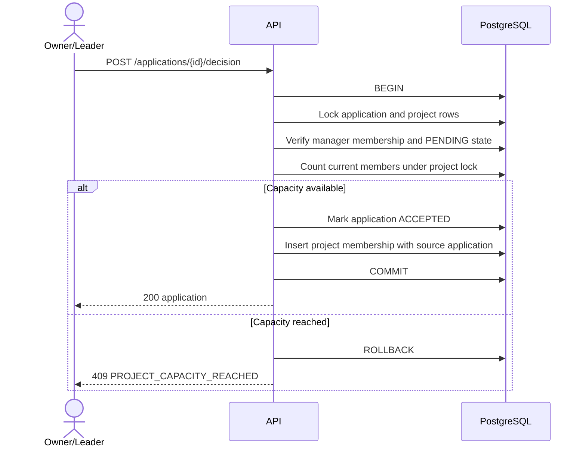

# Core domain API

Phase 6 completes the P0 backend workflow for profiles, projects, applications, team membership,
sprints, tasks, and administration. The exact request/response contract is generated in
`docs/api/openapi.json` and exercised by the Postman collection.

## Authorization matrix

| Capability                | Guest | Student         | Project owner/leader | Admin                |
| ------------------------- | ----- | --------------- | -------------------- | -------------------- |
| Discover public projects  | Yes   | Yes             | Yes                  | Yes                  |
| Edit own profile/skills   | No    | Own only        | Own only             | Own only             |
| Create project            | No    | Yes             | Yes                  | Yes                  |
| Edit/lifecycle project    | No    | No              | Owner                | Project owner only   |
| Apply/withdraw            | No    | Own application | Own application      | Own application      |
| Accept/reject application | No    | No              | Owner/leader         | Only with membership |
| Read workspace            | No    | Members         | Members              | Only with membership |
| Create sprint             | No    | No              | Owner/leader         | Only with membership |
| Create/update task        | No    | Members         | Members              | Only with membership |
| Suspend/restore users     | No    | No              | No                   | Yes                  |
| Read audit log            | No    | No              | No                   | Yes                  |

Global `ADMIN` does not silently bypass project membership. This keeps tenant/project boundaries
explicit; a future support-access policy must be auditable and separately designed.

## Atomic application acceptance

The project row lock serializes competing acceptance transactions. The integration race test sends
two acceptance requests for one remaining slot and proves that exactly one succeeds.

## Optimistic concurrency

Projects and tasks carry a positive integer `version`. Mutations submit the version last read by the
client. A mismatch returns `409 PROJECT_VERSION_CONFLICT` or `409 TASK_VERSION_CONFLICT`; clients
must refetch instead of silently overwriting another user's changes.

## Database-owned invariants

- A project insert automatically creates its owner membership.
- Application identity and accepted membership source are linked by composite foreign keys.
- A task's sprint must belong to the same project.
- Every task assignee must be a member of that task's project.
- Sprint dates, task position, and version domains are checked in PostgreSQL.
- Audit rows reject updates and deletes through a database trigger.
