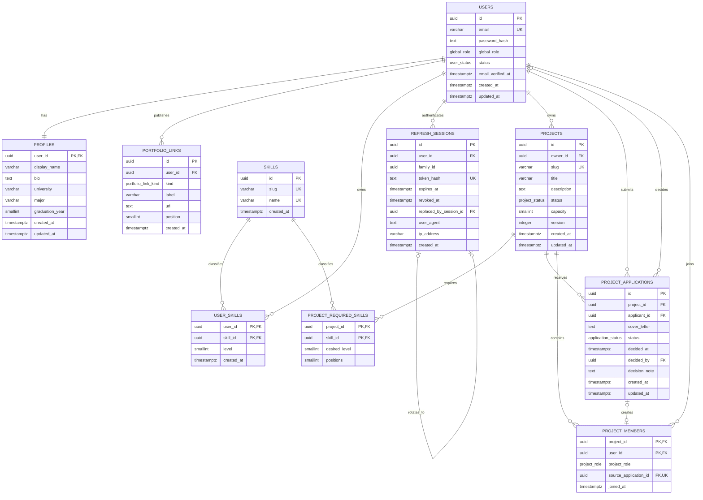

# Physical ERD — Phase 3

This diagram mirrors the tables shipped in the Phase 3 migrations. Task, sprint, review, notification, and messaging tables belong to later phases.

```mermaid
erDiagram
    USERS ||--|| PROFILES : has
    USERS ||--o{ PORTFOLIO_LINKS : publishes
    USERS ||--o{ USER_SKILLS : owns
    SKILLS ||--o{ USER_SKILLS : classifies
    USERS ||--o{ REFRESH_SESSIONS : authenticates
    REFRESH_SESSIONS o|--o| REFRESH_SESSIONS : rotates_to
    USERS ||--o{ PROJECTS : owns
    PROJECTS ||--o{ PROJECT_REQUIRED_SKILLS : requires
    SKILLS ||--o{ PROJECT_REQUIRED_SKILLS : classifies
    USERS ||--o{ PROJECT_APPLICATIONS : submits
    USERS o|--o{ PROJECT_APPLICATIONS : decides
    PROJECTS ||--o{ PROJECT_APPLICATIONS : receives
    USERS ||--o{ PROJECT_MEMBERS : joins
    PROJECTS ||--o{ PROJECT_MEMBERS : contains
    PROJECT_APPLICATIONS o|--o| PROJECT_MEMBERS : creates

    USERS {
        uuid id PK
        varchar email UK
        text password_hash
        global_role global_role
        user_status status
        timestamptz email_verified_at
        timestamptz created_at
        timestamptz updated_at
    }

    PROFILES {
        uuid user_id PK,FK
        varchar display_name
        text bio
        varchar university
        varchar major
        smallint graduation_year
        timestamptz created_at
        timestamptz updated_at
    }

    PORTFOLIO_LINKS {
        uuid id PK
        uuid user_id FK
        portfolio_link_kind kind
        varchar label
        text url
        smallint position
        timestamptz created_at
    }

    SKILLS {
        uuid id PK
        varchar slug UK
        varchar name UK
        timestamptz created_at
    }

    USER_SKILLS {
        uuid user_id PK,FK
        uuid skill_id PK,FK
        smallint level
        timestamptz created_at
    }

    REFRESH_SESSIONS {
        uuid id PK
        uuid user_id FK
        uuid family_id
        text token_hash UK
        timestamptz expires_at
        timestamptz revoked_at
        uuid replaced_by_session_id FK
        text user_agent
        varchar ip_address
        timestamptz created_at
    }

    PROJECTS {
        uuid id PK
        uuid owner_id FK
        varchar slug UK
        varchar title
        text description
        project_status status
        smallint capacity
        integer version
        timestamptz created_at
        timestamptz updated_at
    }

    PROJECT_REQUIRED_SKILLS {
        uuid project_id PK,FK
        uuid skill_id PK,FK
        smallint desired_level
        smallint positions
    }

    PROJECT_APPLICATIONS {
        uuid id PK
        uuid project_id FK
        uuid applicant_id FK
        text cover_letter
        application_status status
        timestamptz decided_at
        uuid decided_by FK
        text decision_note
        timestamptz created_at
        timestamptz updated_at
    }

    PROJECT_MEMBERS {
        uuid project_id PK,FK
        uuid user_id PK,FK
        project_role project_role
        uuid source_application_id FK,UK
        timestamptz joined_at
    }
```
