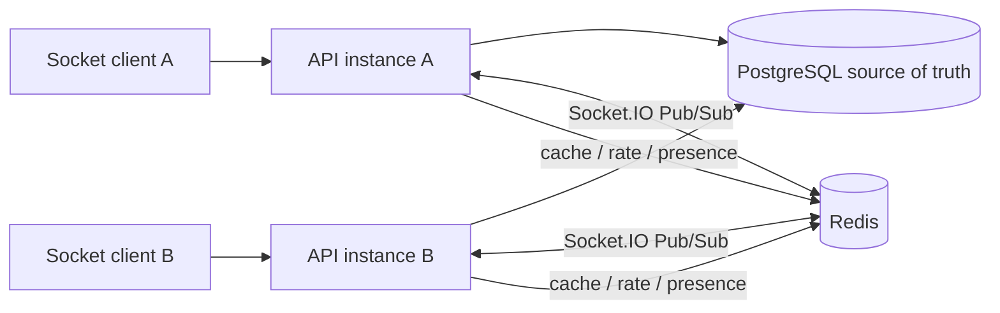
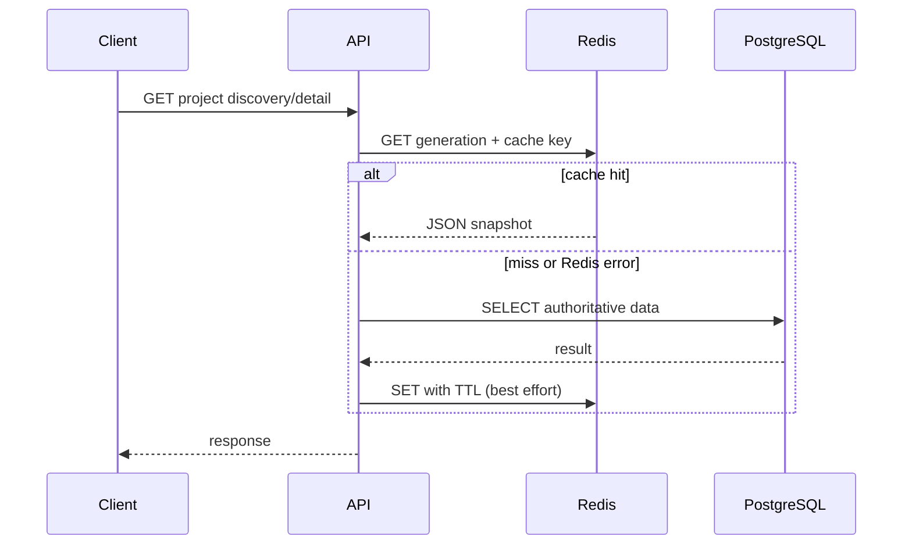

# Redis cache, presence, and Pub/Sub

Phase 11 uses Redis only for acceleration and distributed coordination. PostgreSQL remains the source of truth for users, projects, memberships, tasks, and messages. An empty or unavailable Redis therefore changes latency and cross-instance live delivery, not business correctness.

## Runtime topology

Each API has one command client and dedicated publisher/subscriber clients. Startup is fail-open: if Redis cannot connect, API still starts with no-op cache/rate limiting, local presence, and the default in-process Socket.IO adapter.

## Cache-aside policy

Only public project discovery and public project detail are cached. Authenticated manager views and mutable workspace data continue to query PostgreSQL directly.

| Key pattern                                  | Value                                   | TTL          |
| -------------------------------------------- | --------------------------------------- | ------------ |
| `skillbridge:v1:projects:generation`         | Current invalidation generation         | Persistent   |
| `skillbridge:v1:projects:g{n}:list:{sha256}` | Discovery response for normalized query | 30 s default |
| `skillbridge:v1:projects:g{n}:detail:{slug}` | Public project snapshot                 | 60 s default |
| `skillbridge:v1:rate-limit:auth:{sha256}`    | Login/register/refresh count            | 60 s default |
| `skillbridge:v1:presence:project:{id}`       | User IDs scored by expiry epoch         | Sliding TTL  |

Project create, update, lifecycle transition, and accepted application increment the generation after their PostgreSQL mutation succeeds. New reads immediately use a new namespace; old generation keys expire naturally, so invalidation is O(1) and does not run a production `KEYS` scan.

`GET /health/cache` exposes process-local counters: enabled, hits, misses, errors, operations, and average operation latency. They are diagnostic counters rather than a Prometheus replacement.

## Rate limiting and presence

The auth limiter uses one Lua operation (`INCR`, then `EXPIRE` on the first hit), making the window counter atomic across API instances. It protects register, login, and refresh. A Redis error fails open to avoid turning an optional dependency into a total authentication outage; upstream edge rate limiting remains recommended in production.

Presence combines an exact local socket set with Redis sorted-set heartbeats. Each score is an expiry timestamp. API instances refresh their connected users every third of the presence TTL and remove expired scores while listing. Typing remains ephemeral Socket.IO traffic and is not stored.

## Sticky sessions and recovery

The integration topology forces WebSocket transport and does not need sticky sessions. A production load balancer **must enable sticky sessions** if Socket.IO HTTP long-polling remains enabled, because requests belonging to one polling session must reach the same API instance. Alternatively, deploy WebSocket-only clients and infrastructure after confirming every target network supports it.

Redis Pub/Sub does not persist events and is not the recovery log. Durable message recovery uses the PostgreSQL `(created_at, id)` cursor through `project:join(afterMessageId)` or the REST messages endpoint. Tasks recover through normal REST refetch.

## Failure matrix

| Failure                 | Immediate behavior                                                                | Correctness/recovery                                                            |
| ----------------------- | --------------------------------------------------------------------------------- | ------------------------------------------------------------------------------- |
| Redis absent at startup | Cache/rate limiter disabled; local Socket.IO adapter/presence                     | REST and PostgreSQL continue; same-instance live events work                    |
| Redis lost at runtime   | Cache operations fail open; cross-instance Pub/Sub pauses while clients reconnect | No business data loss; cursor/REST catches up durable events                    |
| PostgreSQL unavailable  | Durable commands fail and are not broadcast                                       | Readiness fails; no false successful message/task                               |
| API instance restarts   | Its sockets disconnect; local typing disappears                                   | Redis presence heartbeat expires; clients reconnect and recover from PostgreSQL |

Integration tests cover mutation invalidation, atomic rate limiting, no-Redis fallbacks already used by the core suites, and a real two-API-instance Socket.IO topology backed by Redis.
