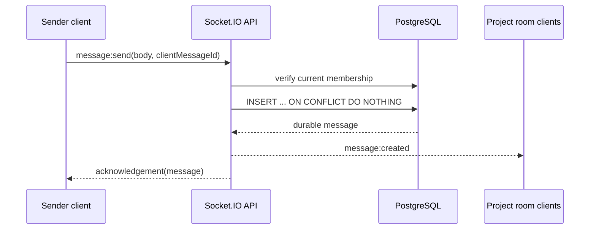
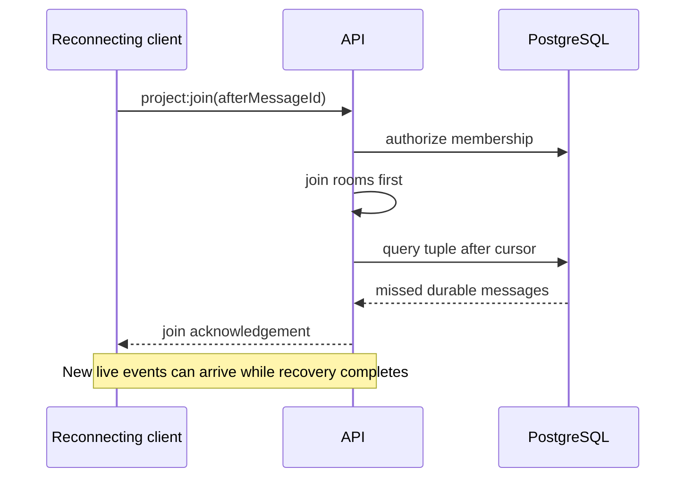

# Socket.IO realtime protocol

Phase 10 thêm trải nghiệm realtime cho team workspace nhưng không thay đổi source of truth: REST vẫn là command/query API chính và PostgreSQL giữ message, task, membership cùng recovery cursor. Socket.IO chỉ giúp client nhận thay đổi sớm hơn.

## Delivery model



Broadcast chỉ xảy ra sau khi insert hoàn tất. `(sender_id, client_message_id)` là unique idempotency key: nếu client retry do mất acknowledgement, server trả lại message cũ và không broadcast hoặc insert lần hai.

REST task create/update commit transaction cùng activity log trước khi `task:changed` được đưa vào project room. Client nhận task snapshot rồi cập nhật TanStack Query cache; REST refetch vẫn là đường đồng bộ cuối cùng.

## Authentication and rooms

Client truyền access token trong Socket.IO handshake:

```ts
io('http://localhost:3000', { auth: { token: accessToken } });
```

Server verify cùng `TokenService` đang dùng cho REST. Mỗi `project:join`, `message:send` và `typing:set` đều kiểm tra membership hiện tại trong PostgreSQL, vì token hợp lệ không đồng nghĩa có quyền vào mọi project.

| Room                       | Nội dung                   | Authorization  |
| -------------------------- | -------------------------- | -------------- |
| `project:{projectId}`      | Task và presence events    | Project member |
| `conversation:{projectId}` | Durable messages và typing | Project member |

## Typed events

Event maps dùng chung nằm trong `@skillbridge/contracts`.

| Hướng           | Event              | Payload/ack                                                         |
| --------------- | ------------------ | ------------------------------------------------------------------- |
| Client → server | `project:join`     | `projectId`, optional `afterMessageId`; ack messages + online users |
| Client → server | `message:send`     | body + UUID idempotency key; ack durable message                    |
| Client → server | `typing:set`       | project + active flag; ack success/error                            |
| Server → client | `message:created`  | Durable message snapshot                                            |
| Server → client | `task:changed`     | Created/updated task snapshot + actor                               |
| Server → client | `presence:changed` | Online/offline user                                                 |
| Server → client | `typing:changed`   | Ephemeral typing state                                              |

Mọi client command có acknowledgement dạng `{ ok: true, data }` hoặc `{ ok: false, error }`. UI dùng timeout tám giây để không treo trạng thái gửi vô hạn.

## Reconnect and missed-event recovery



Server join room trước khi query recovery để đóng race window giữa query và subscription. Client merge theo message ID nên live event và recovery response có thể tới khác thứ tự mà không tạo duplicate.

Cursor comparison `(created_at, id)` chạy hoàn toàn trong PostgreSQL. Không chuyển cursor timestamp qua JavaScript `Date`, vì mất microsecond precision có thể làm message cursor xuất hiện lại.

Nếu socket không dùng được, client có thể gọi:

```http
GET /api/v1/projects/{projectId}/messages?afterMessageId={uuid}&limit=50
Authorization: Bearer {accessToken}
```

Task recovery dùng endpoint REST `GET /projects/{projectId}/tasks` hiện có. Redis Pub/Sub scale live broadcast qua nhiều API instances; recovery vẫn dựa vào PostgreSQL, không dựa vào Redis adapter.

## Presence and typing

Presence giữ local socket set trên từng API instance và heartbeat có TTL trong Redis sorted set. Disconnect chỉ phát offline sau grace TTL để một reconnect nhanh không làm trạng thái nhấp nháy; instance chỉ phát offline nếu Redis cũng xác nhận user không còn heartbeat ở instance khác. Nhiều tab của cùng user dùng socket set; user chỉ offline khi socket cuối cùng mất kết nối và hết TTL.

Typing là ephemeral, không ghi database. Server tự phát `active: false` sau bốn giây nếu client không refresh signal.

## Failure behavior

- PostgreSQL lỗi: message command trả error, không broadcast.
- Ack bị mất: client retry cùng `clientMessageId`, không duplicate side effect.
- Socket disconnect: reconnect dùng cursor/REST để bù durable messages và REST để refetch tasks.
- User không còn membership: join/send/typing bị từ chối dù socket hoặc token cũ vẫn còn.
- API instance restart: local presence/typing mất tạm thời; Redis heartbeat hết hạn tự động; durable message/task không mất.
- Redis mất kết nối: cùng-instance broadcast vẫn hoạt động, cross-instance broadcast tạm dừng; reconnect/REST bù lại durable event.

Key policy, multi-instance topology, sticky-session note và failure matrix nằm trong [redis.md](redis.md).

Integration suite chạy Socket.IO clients thật và xác minh unauthorized room, persist-before-broadcast, idempotent retry, missed-message recovery, typing TTL và task event sau commit.
