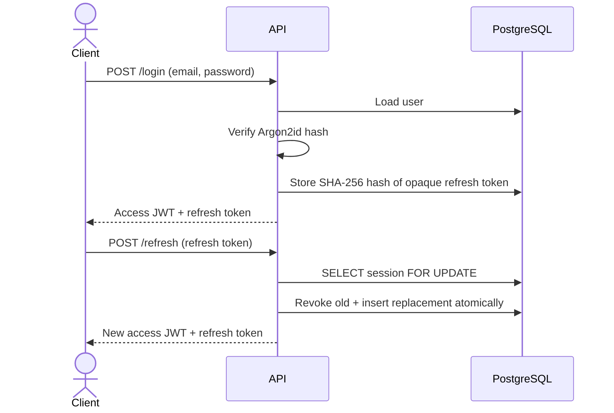

# Authentication security model

Phase 4 implements production-shaped authentication for web, mobile, and API-testing clients. OpenAPI and Postman artifacts are intentionally handled in Phase 5.

## Endpoints

| Method | Path                    | Result                                                       |
| ------ | ----------------------- | ------------------------------------------------------------ |
| `POST` | `/api/v1/auth/register` | Creates user, profile, refresh session, and token pair       |
| `POST` | `/api/v1/auth/login`    | Verifies credentials and creates a refresh-token family      |
| `POST` | `/api/v1/auth/refresh`  | Rotates the refresh token and issues a new access token      |
| `POST` | `/api/v1/auth/logout`   | Revokes the supplied refresh session idempotently            |
| `GET`  | `/api/v1/auth/me`       | Verifies the Bearer access token and returns its user claims |

Successful auth responses use `{ "data": ... }`. Errors use a stable code, safe message, and request ID:

```json
{
  "error": {
    "code": "AUTH_INVALID_CREDENTIALS",
    "message": "The email or password is incorrect.",
    "requestId": "3d742ccb-a4d2-46cc-aa9c-aac4c8e39d90"
  }
}
```

## Password policy

- Password length: 12–128 characters.
- Passwords are hashed with Argon2id; plaintext is never stored or logged.
- Parameters: 19 MiB memory, 2 iterations, parallelism 1.
- The library generates a unique random salt for every hash.
- A fixed dummy Argon2id hash is verified for unknown email addresses to reduce account-enumeration timing differences.

These parameters follow the OWASP minimum Argon2id profile. Production profiling may increase the cost while keeping acceptable login latency.

## Token model



### Access token

- Signed JWT using `HS256` and a secret of at least 32 characters.
- Default lifetime: 15 minutes.
- Validates algorithm, issuer, audience, expiry, subject, email, and global role.
- Carries no password, refresh token, or sensitive profile data.

### Refresh token

- Opaque 48-byte cryptographically random value encoded as base64url.
- Default lifetime: 30 days.
- Only its SHA-256 digest is stored because the token already has high entropy.
- Rotated on every use inside a row-locked transaction.
- Reuse of a replaced token revokes all active sessions in that token family.

Refresh tokens are returned in JSON for Postman and React Native compatibility. Before the browser client is released, the web-specific transport must be reviewed; an `HttpOnly`, `Secure`, appropriately scoped cookie is the preferred browser option when deployment topology permits it.

## Authorization and account state

- `authenticate()` validates Bearer access tokens.
- `requireGlobalRole()` enforces `STUDENT`, `MENTOR`, or `ADMIN` policies at the API boundary.
- Suspended users cannot create new sessions or rotate refresh tokens.
- Project-level roles remain membership-based and are implemented with domain routes in Phase 6.

## Logging and operational behavior

- Every request receives `x-request-id`; a valid incoming value is preserved.
- Authorization, password, refresh token, and cookie paths are configured for log redaction.
- `/health/live` checks the process; `/health/ready` checks PostgreSQL.
- API shutdown stops accepting requests, waits for the HTTP server, then closes the database pool.

## Known follow-up controls

- Rate limiting and login abuse protection are added with Redis.
- Email verification and password reset need an asynchronous email workflow.
- Browser refresh-cookie delivery is finalized with the web deployment topology.
- Audit events for admin and security-sensitive actions are added with the outbox/worker phases.

## References

- [OWASP Password Storage Cheat Sheet](https://cheatsheetseries.owasp.org/cheatsheets/Password_Storage_Cheat_Sheet.html)
- [`jose` JWT signing and verification](https://github.com/panva/jose)
